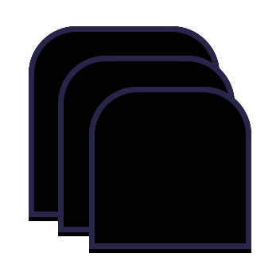

<div align="center">
  
</div>

# Kevlar Tabs

_Inspired by [react-tabs](https://www.npmjs.com/package/react-tabs)_

## Install

```sh
npm install kevlar-tabs
```

## Usage

** This package is only built as a module. ** 

```tsx
import Tabs from 'kevlar-tabs';

export const MyTabs = () => {
  const [activeTab, setActiveTab] = useState(0);

  return (
    <Tabs selected={activeTab} onSelect={setActiveTab}>
      <TabList>
        <Tab>Tab 1</Tab>
        <Tab>Tab 2</Tab>
        <Tab>Tab 3</Tab>
      </TabList>
      <TabPanel>Tab 1 content</TabPanel>
      <TabPanel>Tab 2 content</TabPanel>
      <TabPanel>Tab 3 content</TabPanel>
    </Tabs>
  )
}
```

You can also use named tabs and use the `onNameSelected` callback.

```tsx
<Tab name="tab1">Tab 1</Tab>
```

Some panels could not be defined for some reason. You can manually specify the index of the panel:

```tsx
<TabPanel>Tab 1 content</TabPanel>
<TabPanel index={2}>Tab 3 content</TabPanel>
```

## Tabs properties

| Property | Type | Description |
| --- | --- | --- |
| `autoActivate` | `boolean` | (default: `true`) If true, it prevents auto activation of tabs on focus. |
| `focusOnInit` | `boolean` | (default: `false`) If true, the default selection tab takes the focus on init. |
| `selected` | `number` \| `string` | The index or the name of the selected tab. |
| `onSelect` | `function` | Callback function that is called when a tab is selected. Gives the index as a parameter. |
| `onNameSelect` | `function` | Callback function that is called when a tab is selected. Gives the name as a parameter. |
| `children` | `ReactNode` | `TabList` and `TabPanel` components. |

## Styling

You can use CSS classes that are set on the components:

  - `Tabs` have no class (but you can create your own container).
  - `TabList` has the class `tablist`.
  - `Tab` has the class `tab` in addition to `tab--active` when selected and `tab--disabled` when disabled.
  - `TabPanel` has the class `tabpanel` in addition to `tabpanel--active` when selected.

### Custom classes

You use custom classes for the different states of the elements.

To do it, use the `classNames` property of `Tabs` and pass an object of this shape:

```ts
export type TabsClassNames = Partial<{
  tabList: string
  tab: string
  tabActive: string
  tabDisabled: string
  tabPanel: string
  tabPanelActive: string
  tabPanelDisabled: string
}>
```

You can also pass this configuration to sub-elements: `className`, `classNameActive` and `classNameDisabled` so that different tabs can have different styling since specific configuration takes precedence over the global one.

### With styled-components

Using `styled-components`, one important thing to know is that you have defined the _displayName_ of the component you want to wrap.

For instance:

```ts
import { Tab } from 'kevlar-tabs'
import styled from 'styled-components'

const CustomTab = styled(Tab)`
  color: white;
  background-color: purple;

  &[aria-active='true'] {
    font-weight: bold;
  }

  &[aria-disabled='true'] {
    color: #ccc;
    background-color: #544454;
  }
`

// THIS IS IMPORTANT
CustomTab.displayName = 'Tab'
```

`displayName` has to be set for `Tab`, `TabList` and `TabPanel`, and it takes the name of the component itself.

## Features

 - Disabled tabs
 - Customizable classes
 - Styled-Components compliance
 - Lazy loading
 - Keyboard navigation
 - Auto activation

## Roadmap
  
  - [ ] Documentation site
  - [ ] Contribution guide
